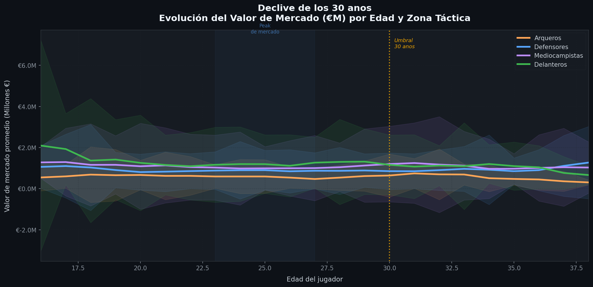
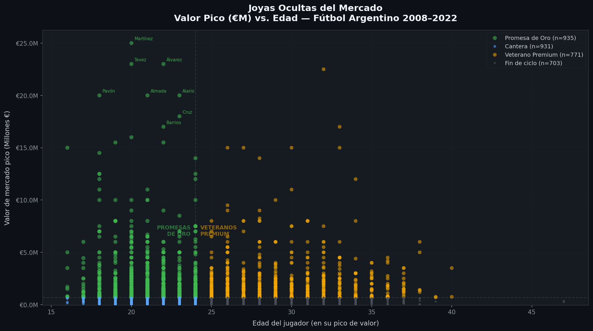
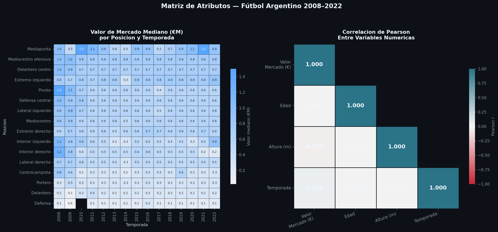
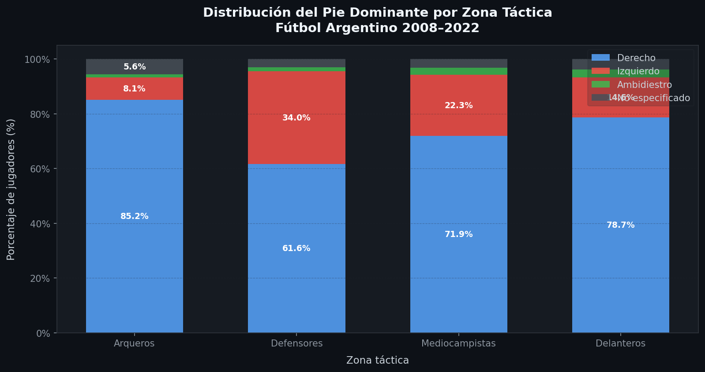

<div align="center">


# ⚽ EDA — Fútbol Argentino 2008–2022

**Análisis Exploratorio de Datos profesional sobre el mercado de jugadores**  
**de la liga argentina a lo largo de 14 temporadas.**

[](https://www.python.org/)
[](https://pandas.pydata.org/)
[](https://seaborn.pydata.org/)
[](https://matplotlib.org/)
[](LICENSE)

</div>

---

## 📋 Descripción

Este proyecto realiza un **EDA (Exploratory Data Analysis) completo y modular** sobre un dataset de jugadores del fútbol argentino, cubriendo **12.092 registros** de **15 temporadas (2008–2022)** y los clubes más importantes del país.

El análisis está pensado como pieza de **portafolio de Ciencia de Datos aplicada al deporte**, con foco en:

- 🔍 Diagnóstico y limpieza profesional de datos sucios
- 📊 Estadística descriptiva táctica (por zona de juego)
- 📈 Visualizaciones avanzadas con **dark-mode premium**
- 💡 Generación de insights accionables para scouting y gestión deportiva

---

## 📁 Estructura del Repositorio

```
EDA_Futbol_Argentino/
│
├── 📄 eda_football.py              # Script principal modular
├── 📊 futbolargentino.xlsx         # Dataset original (Transfermarkt / fuentes públicas)
│
├── 📈 grafico1_declive_30.png      # Valor de mercado por edad y zona táctica
├── 📈 grafico2_joyas_ocultas.png   # Scatter: Promesas de Oro vs Veteranos Premium
├── 📈 grafico3_matriz_atributos.png# Heatmap doble: posición×temporada + correlaciones
├── 📈 grafico4_pie_dominante.png   # Distribución de pie dominante por zona
│
└── 📝 README.md
```

---

## 📊 El Dataset

| Campo | Descripción | Tipo |
|---|---|---|
| `Jugadores` | Nombre completo del jugador | `string` |
| `Posicion` | Posición específica (16 categorías) | `string` |
| `Edad` | Edad al momento del registro | `int` |
| `Altura` | Altura en metros | `float` |
| `Pie` | Pie dominante | `string` |
| `Fichado` | Fecha de fichaje | `string` |
| `Equipo Anterior` | Club de procedencia | `string` |
| `Valor de mercado` | Valuación en euros (Transfermarkt) | `float` |
| `Temporada` | Año de temporada | `int` |
| `Club` | Club actual en esa temporada | `string` |

**Cobertura:** 15 temporadas (2008–2022) · 10+ clubes de Primera División Argentina

---

## 🧹 Módulo 1 — Diagnóstico y Limpieza

El dataset presentó los siguientes problemas reales, cada uno resuelto con una estrategia documentada:

| Problema | Magnitud | Estrategia |
|---|---|---|
| `Valor de mercado = '-'` | 1.704 registros (14.1%) | Imputación por **mediana por posición** |
| `Altura = '-'` | 268 registros | Imputación por **mediana por posición** |
| `Pie` sin dato / NaN | 423 registros | Categoría `'No especificado'` |
| `Equipo Anterior` vacío | 1.536 registros (12.7%) | Reemplazo por `'Sin dato'` |
| Tipos incorrectos (`object`) | Edad, Altura, Valor | `pd.to_numeric(errors='coerce')` |

> **Criterio de diseño:** Se eligió la **mediana por posición** (y no la media global) porque preserva el perfil económico-táctico de cada rol. Un Portero y un Extremo tienen distribuciones de valor completamente distintas; imputar con la media global introduciría sesgo sistemático.

---

## 📐 Módulo 2 — Resumen Estadístico Táctico

Las 16 posiciones se agrupan en **4 zonas tácticas**:

| Zona | N Jugadores | Valor Mediano | Edad Prom. | Altura Prom. |
|---|---|---|---|---|
| 🟢 **Delanteros** | 3.123 | **€700.000** | 24.9 años | 1.78 m |
| 🔵 **Mediocampistas** | 4.030 | €600.000 | 25.1 años | 1.76 m |
| 🟠 **Defensores** | 3.827 | €600.000 | 24.9 años | 1.81 m |
| 🟡 **Arqueros** | 1.112 | €300.000 | 25.2 años | **1.87 m** |

### 🏆 Top 10 Jugadores más Valiosos (pico de carrera)

| # | Jugador | Valor Pico |
|---|---|---|
| 1 | Lautaro Martínez | **€25.0M** |
| 2 | Carlos Tevez | €23.0M |
| 3 | Julián Álvarez | €23.0M |
| 4 | Exequiel Palacios | €22.5M |
| 5 | Cristian Pavón | €20.0M |
| 6 | Lucas Alario | €20.0M |
| 7 | Thiago Almada | €20.0M |
| 8 | Nicolás de la Cruz | €18.0M |
| 9 | Rafael Borré | €17.0M |
| 10 | Wilmar Barrios | €17.0M |

---

## 📈 Módulo 3 — Visualizaciones

### Gráfico 1 · Declive de los 30 años
> Evolución del valor de mercado promedio (€M) según edad, desagregado por zona táctica.



**💡 Insight:** El peak de valor de mercado es universal entre los **23–27 años**. Post-30, el declive es pronunciado en todas las zonas. Los **Delanteros** alcanzan el pico más alto, pero también caen más abruptamente. Los **Mediocampistas** muestran mayor estabilidad de valor a lo largo de la carrera.

---

### Gráfico 2 · Joyas Ocultas del Mercado
> Scatter plot del valor pico (€M) vs. edad, clasificado en 4 cuadrantes de inversión.



**💡 Insight:** El cuadrante **"Promesas de Oro"** (jóvenes con alto valor) identifica los jugadores con mejor ROI potencial de inversión. Las anotaciones marcan automáticamente los 8 menores de 25 años más valiosos — candidatos ideales para estrategias de scouting.

---

### Gráfico 3 · Matriz de Atributos
> Heatmap doble: valor mediano por posición × temporada (izq.) + correlaciones de Pearson (der.)



**💡 Insight:** La **Mediapunta** lidera consistentemente en valor a través de todas las temporadas. La **Edad** correlaciona negativamente con el valor de mercado (r ≈ -0.1). La **Altura** también correlaciona negativamente — los jugadores más bajos y ágiles tienden a ser más cotizados.

---

### Gráfico 4 · Pie Dominante por Zona *(BONUS)*
> Distribución porcentual del pie dominante dentro de cada zona táctica.



**💡 Insight:** El pie **derecho domina (~72%)** de manera homogénea en todas las zonas. Los **zurdos representan ~24%** sin concentración significativa en ningún rol específico. Los ambidiestros son extremadamente raros (<3%), lo que valida su prima de mercado.

---

## 🚀 Cómo Ejecutar

### 1. Clonar el repositorio
```bash
git clone https://github.com/nihuerta/EDA_Futbol_Argentino.git
cd EDA_Futbol_Argentino
```

### 2. Instalar dependencias
```bash
pip install pandas matplotlib seaborn openpyxl numpy
```

### 3. Ejecutar el análisis
```bash
# En Windows (necesario para encoding con tildes y caracteres especiales)
python -X utf8 eda_football.py
```

Los 4 gráficos se generan automáticamente en el directorio actual.

---

## 🏗️ Arquitectura del Script

```
eda_football.py
│
├── cargar_y_limpiar()          # Módulo 1: carga, diagnóstico y limpieza
├── resumen_tactico()           # Módulo 2: estadística por zona táctica
│
├── grafico_declive_edad()      # Gráfico 1: líneas + banda de confianza
├── grafico_joyas_ocultas()     # Gráfico 2: scatter 4 cuadrantes
├── grafico_matriz_atributos()  # Gráfico 3: heatmap doble
├── grafico_bonus_pie_zona()    # Gráfico 4: barras apiladas %
│
└── main()                      # Orquestador del pipeline completo
```

Cada función está **completamente documentada** con docstrings que explican la metodología, los supuestos y los insights esperados.

---

## 🛠️ Stack Tecnológico

| Librería | Versión | Uso |
|---|---|---|
| `pandas` | 2.x | Carga, limpieza y transformación de datos |
| `numpy` | 1.24+ | Operaciones vectorizadas y suavizado |
| `matplotlib` | 3.x | Renderizado de gráficos base |
| `seaborn` | 0.12+ | Heatmaps y paletas de color avanzadas |
| `openpyxl` | 3.x | Lectura de archivos `.xlsx` |

---

## 👤 Autor

**Nicolás Huerta**  
Estudiante de Ciencia de Datos · UADE  
GitHub: [@nihuerta](https://github.com/nihuerta)

---

<div align="center">

*Proyecto desarrollado como parte del portafolio académico — Análisis y Exploración de Datos · UADE 2024*

</div>
